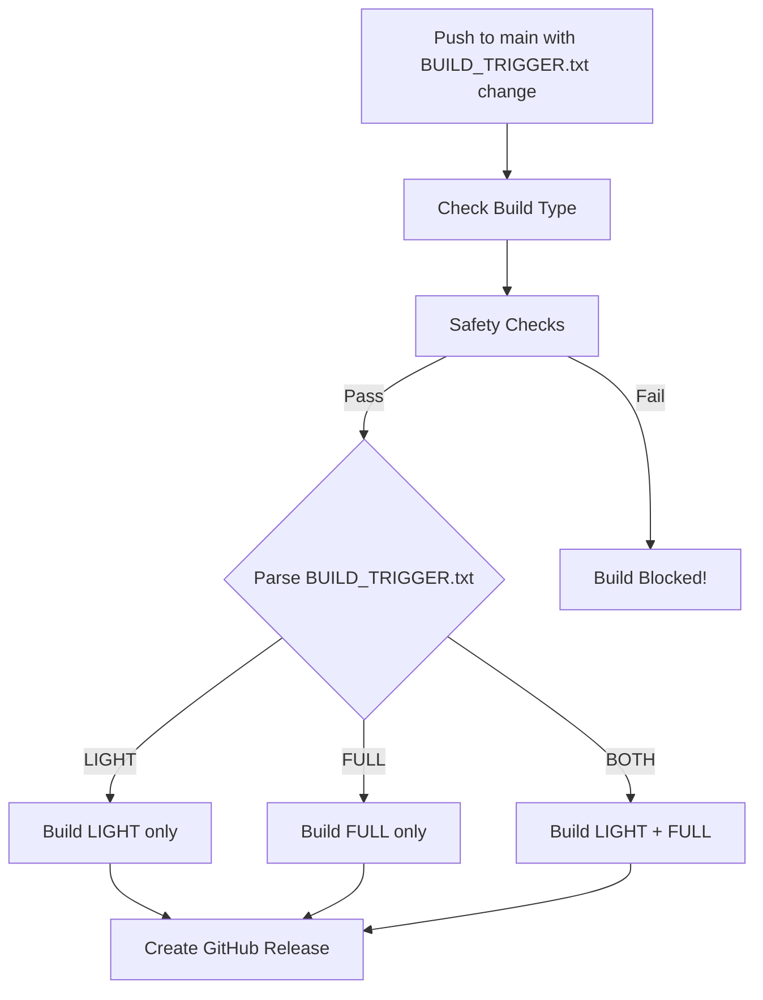

# Building VRS Manager - MODULAR BUILD SYSTEM

This guide explains how to build VRS Manager installers using the automated GitHub Actions workflow with **modular build selection**.

---

## ⚡ Automated Builds (Recommended)

**GitHub Actions automatically builds Windows installers with MODULAR SELECTION!**

### 🎯 Modular Build System - NEW!

You can now choose **what to build**:
- **LIGHT only** (~150MB) - Fast, lightweight version without BERT
- **FULL only** (~2.6GB) - AI-powered version with Korean BERT model
- **BOTH** - Build both installers (default)

---

## 🚀 How to Trigger Builds

### Prerequisites
1. ✅ Version unified across all 12 files
2. ✅ Version check passed: `python3 check_version_unified.py`
3. ✅ All changes committed and pushed to main

### Build Commands

#### Option 1: Build LIGHT Only
```bash
# Append build trigger to BUILD_TRIGGER.txt
echo "Build LIGHT v11201430" >> BUILD_TRIGGER.txt
git add BUILD_TRIGGER.txt
git commit -m "Trigger LIGHT build v11201430"
git push origin main
```

**Use when:**
- Only LIGHT version code changed
- Testing LIGHT-specific features
- Quick iteration (faster build ~5-10 min)

---

#### Option 2: Build FULL Only
```bash
# Append build trigger to BUILD_TRIGGER.txt
echo "Build FULL v11201430" >> BUILD_TRIGGER.txt
git add BUILD_TRIGGER.txt
git commit -m "Trigger FULL build v11201430"
git push origin main
```

**Use when:**
- Only FULL version code changed
- Testing BERT-related features
- Don't need LIGHT version right now

---

#### Option 3: Build BOTH (Default)
```bash
# Append build trigger to BUILD_TRIGGER.txt
echo "Build BOTH v11201430" >> BUILD_TRIGGER.txt
git add BUILD_TRIGGER.txt
git commit -m "Trigger BOTH builds v11201430"
git push origin main
```

**Use when:**
- Releasing new version
- Core code changed (affects both versions)
- Need complete distribution package

---

## 📊 Build Workflow Details

### What Gets Built

#### LIGHT Version (~150MB)
**Includes:**
- All VRS Check processors (RAW, Working, Master, AllLang, DailyWord)
- Core data processing (10-Key TWO-PASS algorithm)
- Excel I/O, formatting, update history
- Punctuation/Space detection for StrOrigin Analysis
- Super Group Word Analysis
- EN/KR Excel process guides

**StrOrigin Analysis:**
- Punctuation-only changes: "Punctuation/Space Change"
- Content changes: "Content Change" (no similarity %)

**Output:** `VRSManager_v11201430_Light_Setup.exe`

---

#### FULL Version (~2.6GB)
**Includes:**
- Everything in LIGHT version
- PyTorch (CPU version)
- Korean SBERT model (447MB, stored in LFS)
- AI semantic similarity analysis
- Complete offline operation

**StrOrigin Analysis:**
- Punctuation-only changes: "Punctuation/Space Change"
- Content changes: Shows BERT similarity % (e.g., "94.5% similar")

**Output:** `VRSManager_v11201430_Full_Setup.exe`

---

## 🔄 Build Process Flow

### GitHub Actions Workflow (with Safety Checks)



### Safety Checks (NEW - Mandatory Before Build)

```
┌─────────────────────────────────────────────────────────────┐
│  SAFETY CHECKS (must pass or build is blocked)              │
├─────────────────────────────────────────────────────────────┤
│  1. Version Unification Check                               │
│     → All 12 files must have same version                   │
│     → Blocks build on mismatch                              │
│                                                             │
│  2. Core Tests (518 test cases)                             │
│     → RAW processor tests                                   │
│     → WORKING processor tests                               │
│                                                             │
│  3. Phase 4 Tests (48 test cases)                           │
│     → Priority ranking validation                           │
│     → New column tests                                      │
│                                                             │
│  4. Security Audit (pip-audit)                              │
│     → Checks for vulnerable dependencies                    │
│     → Informational only (doesn't block)                    │
└─────────────────────────────────────────────────────────────┘
```

**Build is blocked if:**
- Version mismatch detected across files
- Any test fails

### Build Steps (Automated)

1. **Check Build Type** - Parse BUILD_TRIGGER.txt for LIGHT/FULL/BOTH
2. **Safety Checks (NEW!)** - Run version check, tests, security audit
3. **Checkout Code** - Pull latest from main (includes LFS for FULL)
4. **Setup Python 3.10** - Install Python environment
5. **Install Dependencies**
   - LIGHT: `pandas`, `openpyxl`, `numpy`, `pyinstaller`
   - FULL: All requirements.txt (includes PyTorch, transformers)
6. **Verify BERT Model** (FULL only) - Check LFS model exists
7. **Build Executable** - PyInstaller with .spec file
8. **Verify Build** - Check .exe exists and log size
9. **Compile Installer** - Inno Setup creates Windows installer
10. **Upload Artifacts** - Store installers (7-day retention)
11. **Create GitHub Release** - Publish release with downloadable installers

**Build Time:**
- LIGHT: ~5-10 minutes
- FULL: ~15-20 minutes
- BOTH: ~25-30 minutes (parallel execution)

---

## 📦 Getting Pre-Built Installers

### Option 1: Latest Artifacts (7-day retention)
1. Go to [Actions tab](https://github.com/NeilVibe/VRS-Manager/actions)
2. Click latest successful "Build LIGHT and FULL Installers" run
3. Download artifacts:
   - `VRSManager_Light_Setup` (if LIGHT was built)
   - `VRSManager_Full_Setup` (if FULL was built)

### Option 2: GitHub Releases (Permanent)
1. Go to [Releases page](https://github.com/NeilVibe/VRS-Manager/releases)
2. Find version tag (e.g., `v11201430`)
3. Download installer(s):
   - `VRSManager_v11201430_Light_Setup.exe`
   - `VRSManager_v11201430_Full_Setup.exe`

---

## 🛠 Manual Build (Advanced - Local Development)

For local testing, you can build manually:

### Prerequisites
- Python 3.10
- PyInstaller: `pip install pyinstaller`
- Inno Setup (Windows only)

### Build LIGHT Locally
```bash
# Install LIGHT dependencies
pip install pandas openpyxl numpy pyinstaller

# Build with PyInstaller
pyinstaller VRSManager_light.spec --clean --noconfirm --distpath dist_light

# Verify
ls -lh dist_light/VRSManager/VRSManager.exe
```

### Build FULL Locally
```bash
# Install FULL dependencies
pip install -r requirements.txt
pip install pyinstaller

# Download BERT model (if not already present)
python3 download_bert_model.py

# Build with PyInstaller
pyinstaller VRSManager.spec --clean --noconfirm --distpath dist_full

# Verify
ls -lh dist_full/VRSManager/VRSManager.exe
```

### Compile Installer (Windows)
```bash
# LIGHT installer
"C:\Program Files (x86)\Inno Setup 6\ISCC.exe" installer\vrsmanager_light.iss

# FULL installer
"C:\Program Files (x86)\Inno Setup 6\ISCC.exe" installer\vrsmanager_full.iss
```

---

## 📋 Build Checklist

Before triggering builds, ensure:

- [ ] **Version unified** across all 12 files
- [ ] **Version check passed**: `python3 scripts/check_version_unified.py`
- [ ] **All tests passing** (now checked automatically in CI!):
  - `python3 tests/test_unified_change_detection.py` (518 cases)
  - `python3 tests/test_phase4_comprehensive.py` (48 cases)
- [ ] **Excel guides updated** (if needed): `python3 scripts/update_excel_guides.py`
- [ ] **Roadmap updated** with latest changes
- [ ] **All changes committed and pushed** to main
- [ ] **Decided which to build**: LIGHT, FULL, or BOTH

**Note:** Safety checks now run automatically in CI - if any fail, build is blocked!

---

## 🔍 Monitoring Builds

### Check Build Progress
1. Go to [GitHub Actions](https://github.com/NeilVibe/VRS-Manager/actions)
2. Click on the running workflow
3. Watch live logs for each job

### Build Jobs
- **check-build-type** - Determines what to build (LIGHT/FULL/BOTH)
- **safety-checks** - Version check, tests, security audit (NEW!)
- **build-light** - Builds LIGHT installer (if triggered)
- **build-full** - Builds FULL installer (if triggered)
- **create-release** - Creates GitHub Release with installers

### Build Success Indicators
✅ All jobs green (passed)
✅ Artifacts uploaded
✅ GitHub Release created
✅ Installers downloadable

### Build Failure Troubleshooting

❌ **Job failed** - Click job to see error logs
❌ **Model not found (FULL)** - Check Git LFS setup
❌ **Import errors** - Check dependencies in requirements.txt
❌ **Installer compile failed** - Check .iss file version numbers

#### ⚠️ CRITICAL: LFS Bandwidth Quota Exceeded

**Error Message:**
```
batch response: This repository exceeded its LFS budget.
error: failed to fetch some objects from 'github.com/[repo]/info/lfs'
```

**Root Cause:**
- GitHub LFS has monthly bandwidth quota (1GB free, then paid)
- BERT model is 447MB in LFS
- Each download counts against quota

**Solution (Already Fixed in Workflow):**
- ✅ LIGHT build uses `lfs: false` (doesn't need BERT model)
- ✅ FULL build uses `lfs: true` (needs BERT model)
- ✅ Release job uses `lfs: false` (only needs artifacts)

**What Was Wrong:**
- All 3 jobs were using `lfs: true`
- LIGHT and Release jobs were downloading 447MB unnecessarily
- Multiple build attempts quickly exceeded quota

**Key Lesson:**
- **Only enable LFS where actually needed!**
- LIGHT version = No BERT = No LFS needed
- FULL version = BERT included = LFS required
- This is WHY modular builds are important - optimization!

**If You See This Error:**
1. Check GitHub LFS quota: Settings → Billing → Git LFS Data
2. Verify workflow jobs only use `lfs: true` when needed
3. Wait for quota reset (monthly) or upgrade plan

---

## 📝 Build Examples

### Example 1: Quick LIGHT Build for Testing
```bash
# Scenario: Fixed a bug in Working processor, only need LIGHT version
echo "Build LIGHT v11201450" >> BUILD_TRIGGER.txt
git add BUILD_TRIGGER.txt
git commit -m "Trigger LIGHT build v11201450 - Bug fix in Working processor"
git push origin main
```

**Result:** Only LIGHT installer built (~5-10 min), saves time and storage

---

### Example 2: FULL Build for BERT Feature
```bash
# Scenario: Improved BERT similarity algorithm, only FULL version affected
echo "Build FULL v11201510" >> BUILD_TRIGGER.txt
git add BUILD_TRIGGER.txt
git commit -m "Trigger FULL build v11201510 - Enhanced BERT similarity"
git push origin main
```

**Result:** Only FULL installer built (~15-20 min)

---

### Example 3: Release Build (BOTH)
```bash
# Scenario: New version release with core features affecting both versions
echo "Build BOTH v11201530" >> BUILD_TRIGGER.txt
git add BUILD_TRIGGER.txt
git commit -m "Trigger BOTH builds v11201530 - Phase 3.1.3 Release"
git push origin main
```

**Result:** Both installers built (~25-30 min), complete distribution ready

---

## 🎯 Best Practices

### When to Build LIGHT Only
- Bug fixes in core logic (not BERT-specific)
- UI/UX improvements
- Data processing optimizations
- Quick iteration during development
- Testing installer creation process

### When to Build FULL Only
- BERT model updates
- Similarity algorithm improvements
- FULL-specific feature additions
- PyTorch dependency updates

### When to Build BOTH
- **New version releases** (recommended)
- Core architecture changes
- Shared utility updates
- Excel guide updates
- Before announcing new version to users

---

## 📊 Storage & Retention

### GitHub Artifacts
- **Retention:** 7 days (configurable in workflow)
- **Purpose:** Temporary testing, debugging
- **Auto-cleanup:** Yes, after 7 days

### GitHub Releases
- **Retention:** Permanent
- **Purpose:** Official distribution to users
- **Auto-cleanup:** No, must delete manually

**Recommendation:** Use artifacts for testing, releases for distribution

---

## 🚀 Distribution

### For End Users
1. Direct them to [Releases page](https://github.com/NeilVibe/VRS-Manager/releases)
2. Recommend LIGHT version for most users
3. FULL version for advanced users needing AI similarity

### Installation Paths
- **Default:** `C:\Users\[Username]\Desktop\VRS Manager`
- **No admin required** (lowest privileges)
- **100% portable** - Can move folder anywhere after installation

### Offline Distribution
1. Download installer from Releases
2. Transfer to offline computer via USB
3. Run installer on offline machine
4. Works 100% offline (BERT model bundled in FULL)

---

## 🔧 Technical Details

### Build Configuration Files
- **VRSManager_light.spec** - LIGHT version PyInstaller config
- **VRSManager.spec** - FULL version PyInstaller config
- **installer/vrsmanager_light.iss** - LIGHT Inno Setup script
- **installer/vrsmanager_full.iss** - FULL Inno Setup script
- **.github/workflows/build-installers.yml** - GitHub Actions workflow

### Version Numbers in Build Files
**IMPORTANT:** Version appears in multiple places in build files:
- Installer filenames: `VRSManager_v11201430_Light_Setup.exe`
- .iss AppVersion: `#define MyAppVersion "11201430"`
- Artifact paths in workflow
- Release tag: `v11201430`

**Always verify** these match using `check_version_unified.py` before building!

---

## 📖 See Also

- **CLAUDE.md** - Developer quick reference
- **roadmap.md** - Complete version history
- **BUILD_TRIGGER.txt** - Build trigger file with examples
- **README.md** - Project overview

---

**Last Updated:** 2025-12-02 (v12021800)
**Build System Version:** Modular with Safety Checks (LIGHT/FULL/BOTH selection)
